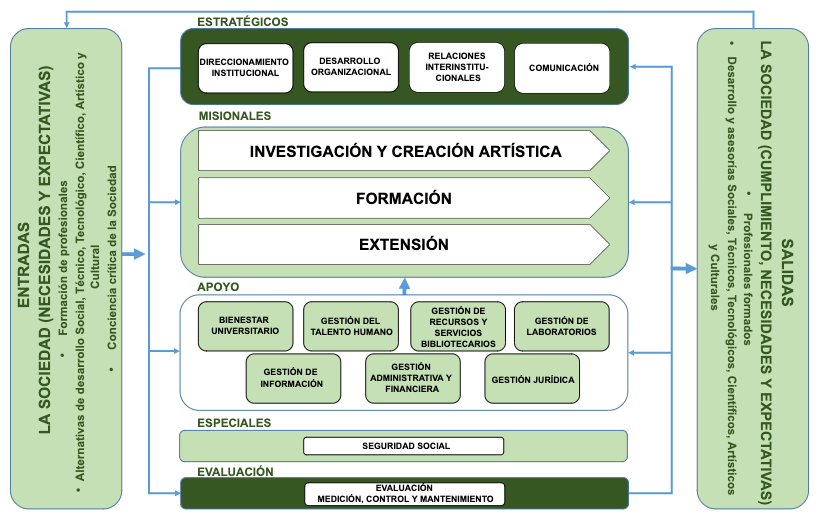

# Generalidades

### Objetivos

La presente guía brinda los lineamientos metodológicos para la definición y aplicación de indicadores de gestión
asociados a los procesos vigentes en la UNAL, a través de los cuales se realice un monitoreo oportuno al
cumplimiento de sus objetivos y metas, y se tomen decisiones informadas a partir del análisis de los resultados obtenidos, en el marco del mejoramiento continuo del sistema de gestión de calidad institucional.

### Alcance

Las directrices que se presentan en este documento aplican a la totalidad de los procesos vigentes en la UNAL
(Ver figura \@ref(fig:figura1): Mapa de procesos UNAL) y comprenden las fases para el diseño, medición y análisis de los indicadores de gestión correspondientes, así como para la toma de decisiones a partir de los resultados
obtenidos.

Dichos lineamientos exceptúan la medición de la satisfacción de los usuarios, que se realiza a partir de la aplicación de la encuesta institucional diseñada para este fin, así como el posterior análisis de resultados.

```{r figura1, echo=FALSE, out.width='100%', fig.align='center', fig.cap='Mapa de procesos UNAL.'}

```
Fuente: @Castro2021Jun

### Marco conceptual

#### Estadísticas

Las estadísticas son cifras de interés social e institucional las cuales se caracterizan, en el ámbito de lo público, principalmente por: ser construidas a partir de información poblacional disponible en registros administrativos y censos o inferida a través de estimaciones provenientes de muestras probabilísticas o no probabilísticas; permitir caracterizar/desagregar temporalmente, temáticamente y geográficamente rasgos de interés de los individuos que conforman las poblaciones o muestras de interés; hacer uso conceptos, estándares y nomenclaturas internacionales, nacionales e institucionales que favorezcan su interpretación y comparación; estar conformadas por cifras agregadas de naturaleza descriptiva derivadas de conteos o de mediciones; representar el presente y el pasado a través de la disposición de series de tiempo; ser susceptibles de ser representadas de manera tabular y gráfica (visualización); estar orientadas y delimitadas por normas; ser fácilmente interpretables y accesibles a través de múltiples mecanismos de disposición y divulgación; ser inclusivas; ser construidas a través de un proceso estadístico y finalmente, a partir de la comparación entre e intra poblaciones de las cifras agregadas, facilitar la creación de indicadores estadísticos.

#### Estadísticas Oficiales

Las estadísticas oficiales incluyen el subconjunto de estadísticas disponibles a nivel nacional y en cada una de las sedes de la Universidad asociadas a poblaciones de interés para la totalidad de procesos y acciones institucionales. Estas, más que emerger y pertenecer a un proceso particular, son útiles y requeridas por la totalidad de los procesos existentes a nivel institucional. Entre las principales categorías que agrupan las estadísticas oficiales de la Universidad tenemos: información de programas académicos, aspirantes y admitidos, matriculados, graduados, docentes, administrativos, investigación, extensión e innovación, capacidad financiera, etc. Las construcción, disposición y actualización de las estadísticas oficiales de la Universidad Nacional de Colombia, así como la disposición de los lineamientos conceptuales, metodológicos y técnicos requeridos para su gestión, se encuentra a cargo de las áreas de estadística adscritas a las direcciones de planeación y estadística en los niveles nacional y sede. La información estadística oficial de la Universidad, en su mayoría, se encuentra disponible o accesible a través del [sitio web institucional de estadísticas oficiales.](http://estadisticas.unal.edu.co/home/) 

#### Indicadores Estadísticos 

Los indicadores estadísticos conservan, en términos generales, los mismos atributos que las estadísticas, pero a diferencia de estas, este tipo de mediciones requieren de un trabajo técnico de mayor complejidad que el exigido en las estadísticas. Este tipo de mediciones requieren de fórmulas o de procedimientos metodológicos para efectos del cálculo de la medida de interés y pueden ser de naturaleza simple como las tasas, las razones y las proporciones o complejos como los índices y las escalas.

#### Indicadores de Gestión 

Los indicadores de gestión, a diferencia de las estadísticas y los indicadores estadísticos, se caracterizan porque miden el cumplimiento de una apuesta de futuro (meta) o el rango de desempeño asociado a una acción o conjunto de acciones pertenecientes a una política, proyecto o proceso institucional. Para su construcción y medición se requiere la disposición de líneas de base y, dependiendo del tipo de meta o rango de desempeño a ser monitoreado, pueden ser de diferentes tipos: flujo, acumulación, capacidad, reducción, reducción por periodo, stock. Los elementos conceptuales, metodológicos y técnicos que constituyen los indicadores de gestión o cumplimiento difieren de manera significativa respecto de los constitutivos de las estadísticas y los indicadores estadísticos. 

#### Variable 

Es una característica asociada a un ámbito de interés que puede variar y cuya variación adopta diversos posibles valores. Los valores asociados a una variable pueden medirse u observarse de manera directa – variables observables - o indirecta – variables no observables -.

#### Variables observables 

Cualquier atributo o característica de fácil definición, medición y consenso dentro de un área, disciplina o teoría científica. Hacen referencia a algo que se sabe que existe y que se puede observar, manipular y medir de manera directa. La edad, el sexo o la profesión de una persona, son ejemplos de variables observables y de interés en el ámbito de la educación o las ciencias de la salud, por ejemplo.

#### Variables no observables 

Cualquier entidad o categoría conceptual de difícil definición, medición y consenso dentro de un área, disciplina o teoría científica. También conocidas como variables latentes o constructos, hacen referencia a algo que se sabe que existe pero que no se puede observar, manipular y medir de manera directa –no observables-. La inteligencia, la personalidad, la creatividad, el bienestar individual o social, son algunos ejemplos de constructos de interés académico para disciplinas como la psicología, la economía o la sociología; en contraste, por ejemplo, la satisfacción del usuario, lo es para el ámbito de la gestión administrativa.

### Documentos de referencia 

* @bonnefoy2005indicadores
* @coneval2013manual
* @sanchez2018guia
* @dane2014guia
* @publica2015guia

### Condiciones generales 

#### Objetivos de la cuantificación, medición y seguimiento a la gestión de los procesos

* Determinar el nivel de desempeño de los procesos de la UNAL respecto a los objetivos y las metas fijadas, para establecer que tan cerca o lejos se encuentra de su cumplimiento.

* Tomar decisiones a partir del análisis de los resultados obtenidos bien sea para mantener, prevenir o mejorar el estado actual de los procesos con respecto a sus objetivos y metas.

* Presentar información que agregue valor a la gestión y que permita la rendición de cuentas a las partes interesadas (usuarios, directivos, entes de control internos y externos) frente a la aplicación de los recursos en la ejecución de los procesos, como muestra de transparencia en el ejercicio de la función pública.

#### Normativa aplicable 

```{r, echo=FALSE}
nombre <- c("TÍTULO XII. DEL RÉGIMEN ECONÓMICO Y DE LA HACIENDA PÚBLICA. Capítulo 2. De los planes de desarrollo. Art 343. La entidad nacional de planeación que señale la ley, tendrá a su cargo el diseño y la organización de los sistemas de evaluación de gestión y resultados de la administración pública, tanto en lo relacionado con políticas como con proyectos de inversión, en las condiciones que ella determine.","*“Por la cual se establecen normas para el ejercicio del control interno en las entidades y organismos del Estado y se dictan otras disposiciones”*. Art 2. Objetivos del Sistema de Control Interno. Literal d) Garantizar la correcta evaluación y seguimiento de la gestión organizacional. Art 4. Elementos para el Sistema de Control Interno. Literal j) Organización de métodos confiables para la evaluación de la gestión.","Por la cual se crea el sistema de gestión de la calidad en la Rama Ejecutiva del Poder Público y en otras entidades prestadoras de servicios. Art 4. Requisitos para su implementación. Literal h) Realizar el seguimiento, el análisis y la medición de estos procesos. PARÁGRAFO 1º. Este sistema tendrá como base fundamental el diseño de indicadores que permitan, como mínimo, medir variables de eficiencia, de resultado y de impacto que faciliten el seguimiento por parte de los ciudadanos y de los organismos de control, los cuales estarán a disposición de los usuarios o destinatarios y serán publicados de manera permanente en las páginas electrónicas de cada una de las entidades cuando cuenten con ellas.","*“Por medio del cual se expide el Decreto Único Reglamentario del Sector de Función Pública”*. Título 21. Sistema de Control Interno. Capítulo 3. Sistema Institucional y Nacional de Control Interno.ARTÍCULO 2.2.21.3.4 Planeación. Parágrafo. Literal d) La Oficina de Control Interno o quien haga sus veces: Evalúa el proceso de planeación, en toda su extensión; implica, entre otras cosas y con base en los resultados obtenidos en la aplicación de los indicadores definidos, un análisis objetivo de aquellas variables y/o factores que se consideren influyentes en los resultados logrados o en el desvío de los avances. La identificación de estas variables, su comportamiento y su respectivo análisis permite que la formulación de las recomendaciones de ajuste o mejoramiento al proceso, se realice sobre soportes y criterios válidos y visibles fortaleciendo así la función asesora de estas oficinas.","*“Por medio del cual se modifica el Decreto 1083 de 2015, Decreto Único Reglamentario del Sector Función Pública, en lo relacionado con el Sistema de Gestión establecido en el artículo 133 de la Ley 1753 de 2015”* Capítulo 2. Politicas de Gestión y Desempeño Institucional. ARTÍCULO  2.2.22.2.1. Políticas de Gestión y Desempeño Institucional. Numeral 16. Seguimiento y evaluación del desempeño institucional.", "*“Por la cual se actualiza el Sistema de Control Interno de la Universidad Nacional de Colombia, y se derogan las Resoluciones de Rectoría 1428 de 2006 y 139 de 2018”*. Art. 5. Objetivos específicos del Sistema de Control Interno. Numeral 5.3 Objetivos de control de evaluación y seguimiento. Literal  a) Garantizar que el Sistema de Control Interno disponga de sus propios mecanismos de verificación y evaluación, que faciliten en tiempo real, realizar seguimiento a la gestión de la Universidad por parte de los diferentes niveles de autoridad, permitiendo acciones oportunas de prevención, corrección y de mejoramiento… e) Garantizar razonablemente la correcta evaluación y seguimiento de la gestión académico administrativa… Art 11. Responsabilidad del Sistema de Gestión. Literal a) Apoyar el proceso de implementación y fortalecimiento continuo del Modelo Estándar de Control Interno bajo las orientaciones del representante de la dirección… d) Trabajar en coordinación con los servidores designados por las otras áreas en aquellas actividades requeridas para la implementación y fortalecimiento continuo del Modelo Estándar de Control Interno.")

nombre1<- c("*“Por la cual se define, se estructura y se establecen roles y responsabilidades del Sistema Integrado de Gestión Académico, Administrativo y Ambiental en la Universidad Nacional de Colombia y se derogan las Resoluciones que le sean contrarias”*")
int<- c("","","","","","X","X")
ext<- c("X","X","X","X","X","","")
```

```{r, echo=FALSE, warning=FALSE, fig.cap='Ejemplo'}
library(tidyr)
library(gt)
tabla1 <- tibble(`Tipo de documento` = 
c("Constitución Política de Colombia","Ley 87 de 1993","Ley 872 de 2003","Decreto 1083 de 2015","Decreto 1499 de 2017 ","Resolución 316 de 2018", "Resolución 1528 de 2018"), `Titulo de documento` = c(nombre, nombre1),`Interna`= int, `Externa`= ext)

knitr::kable(tabla1, caption = '*Marco normativo aplicable a la cuantificación, medición y seguimiento a la gestión de los procesos UNAL*' )

```

#### Roles y responsabilidades en la cuantificación, medición y seguimiento a la gestión de los procesos


```{r tabla2, echo=FALSE}
sigla <- c("CGR","CNCSCI","CSIGA","ONCI","DNPE","VRS/DS","LSNN","CSS","LPNN","LPS","LPF/C/I/L","AE/AI")
rol <- c("Contraloría General de la República","Comité Nacional de Coordinación del Sistema de Control Interno","Comité Directivo SIGA","Oficina Nacional de Control Interno","Dirección Nacional de Planeación y Estadística","Vicerrectoría de Sede / Dirección de Sede ","Líder SIGA NN","Coordinador SGC Sede","Líder de proceso nivel nacional","Líder de proceso sede","Líder de proceso Facultad, Centro, Instituto o Laboratorio","Auditor externo o interno")
descripcion <- c("Ejercer control fiscal de la institución incluyendo el control financiero, de gestión y de resultados, fundado en la eficacia, la economía, la equidad y la valoración de los costos ambientales.","	Evaluar el estado del Sistema de Control Interno de acuerdo con las características propias de la Universidad Nacional de Colombia y aprobar las modificaciones, actualizaciones y acciones de fortalecimiento del sistema a partir de la normatividad vigente, los informes presentados por el jefe de control interno o quien haga sus veces, organismos de control y las recomendaciones del Sistema Integrado de Gestión Académico Administrativo y Ambiental, o quien haga sus veces.","Definir lineamientos y directrices que incorporen de manera estratégica y unificada en todas las Sedes de la Universidad Nacional de Colombia, la apropiación, implementación, evaluación, seguimiento y mejora del  componente cuantificación, medición y seguimiento  a la gestión de los procesos, que hace parte del SIGA.","Evaluar la planeación, ejecución y control en la gestión de los procesos, programas, planes y proyectos de la Universidad, desde el rol del evaluador independiente. Su finalidad es generar información, recomendaciones, alertas y aprendizajes que contribuyan al mejoramiento de la gestión.","• Brindar apoyo y acompañamiento metodológico a la VRG en la adecuación del modelo de medición, cuantificación y seguimiento a la gestión de los procesos de acuerdo a las necesidades de la UNAL. <br> •	Suministrar las cifras oficiales de la UNAL requeridas en el proceso de construcción de los indicadores de gestión de los procesos.","Mantenerse informado de los lineamientos para la cuantificación, medición y seguimiento a la gestión de los procesos y su ejecución al interior de la Sede. ")
descripcion1 <- c("• Formular una metodología e instrumentos para la cuantificación, medición y seguimiento a la gestión de los procesos en la UNAL. <br> • Proporcionar entrenamiento a los Líderes del NN y Sedes en la metodología para la cuantificación, medición y seguimiento a la gestión de los procesos de la UNAL. <br> • Coordinar la ejecución de los lineamientos para la cuantificación, medición y seguimiento a la gestión de los procesos con los Líderes del NN. <br >*	Asistir a los Líderes del NN para la aplicación de la metodología para la cuantificación, medición y seguimiento a la gestión de los procesos.  <br> • Consolidar y presentar los resultados de la medición de la gestión de los procesos a las partes interesadas, a partir de la información proporcionada por los Líderes de los mismos en el NN.   <br>• Desarrollar las actividades que le corresponden al Líder del Nivel Nacional para los procesos que no cuentan con esta figura en las Sedes. <br> • Responder a los requerimientos de entes de control tanto internos como externos para demostrar la conformidad de la cuantificación, medición y seguimiento a la gestión de los procesos de la UNAL con los compromisos tanto normativos como institucionales.", "• Replicar la metodología para la cuantificación, medición y seguimiento a la gestión de los procesos UNAL a los líderes de los mismo en el nivel de Sede. <br> • Coordinar la ejecución de los lineamientos para la cuantificación, medición y seguimiento a la gestión de los procesos en la UNAL, con los Líderes de los mismos en la Sede, Facultad, Centro, Instituto o Laboratorio, según el caso. <br> • Asistir a los Líderes de los procesos de la Sede para el desarrollo de las diferentes etapas de la cuantificación, medición y seguimiento a su gestión. <br> • Velar por que los Líderes de los procesos de la Sede entreguen la información producto del desarrollo de las etapas de la gestión de los riesgos oportunamente a sus pares en el NN. <br> • Revisar la calidad de la información de la cuantificación, medición y seguimiento a la gestión de los procesos, reportada por los líderes en la sede, para verificar que guarde coherencia con la metodología definida por la UNAL <br> • Consolidar la información de cuantificiación, medición y seguimiento a la gestión de los procesos generada en la sede. <br> • Generar los reportes e informes de gestión relacionados con la medición de indicadores de procesos correspondiente a la sede. <br> • Responder a los requerimientos de entes de control tanto internos como externos para demostrar la conformidad de la cuantificación, medición y seguimiento a la gestión de los procesos de la UNAL con los compromisos tanto normativos como institucionales. <br>")
descripcion2 <- c("• Desarrollar las diferentes etapas para la cuantificación, medición y seguimiento a la gestión del proceso de manera participativa con sus pares de acuerdo a su nivel de aplicación (Sede, Facultad, Centro, Instituto o Laboratorio). <br> • Consolidar y presentar los resultados del desarrollo de las diferentes etapas para la cuantificación, medición y seguimiento a la gestión del proceso a las partes interesadas (Líder SIGA NN, Líder proceso Sede y auditores internos o externos). <br> • Responder a los requerimientos de entes de control tanto internos como externos para demostrar la conformidad de la cuantificación, medición y seguimiento a la gestión de los procesos de la UNAL con los compromisos tanto normativos como institucionales.", "• Desarrollar las diferentes etapas para la cuantificación, medición y seguimiento a la gestión del proceso de manera participativa con sus pares de acuerdo a su nivel de aplicación (Nivel Nacional, Facultad, Centro, Instituto o Laboratorio). <br> • Consolidar y presentar los resultados del desarrollo de las diferentes etapas para la cuantificación, medición y seguimiento a la gestión del proceso a las partes interesadas (Líder proceso en el nivel nacional, Líder de proceso en Facultad, Centro, Instituto o Laboratorio y auditores internos o externos). <br> • Responder a los requerimientos de entes de control tanto internos como externos para demostrar la conformidad de la cuantificación, medición y seguimiento a la gestión de los procesos de la UNAL con los compromisos tanto normativos como institucionales.","• Desarrollar las diferentes etapas para la cuantificación, medición y seguimiento a la gestión del proceso de manera participativa con sus pares de acuerdo a su nivel de aplicación (Nivel Nacional, Sede). <br> • Consolidar y presentar los resultados del desarrollo de las diferentes etapas para la cuantificación, medición y seguimiento a la gestión del proceso a las partes interesadas (Líder de proceso en el nivel nacional, Líder de proceso en Sede y auditores internos o externos). <br> • Responder a los requerimientos de entes de control tanto internos como externos para demostrar la conformidad de la cuantificación, medición y seguimiento a la gestión de los procesos de la UNAL con los compromisos tanto normativos como institucionales.", "Evaluar los resultados de la cuantificación, medición y seguimiento de la gestión de los procesos de la UNAL de acuerdo con las evidencias recopiladas en contraste con los criterios de auditoria establecidos." )
referencia <- c("Constitución Política de 1991 Art 267 inciso 3","Resolución 316 de 2018 Art 8. Numeral 8.1. Literal a).","Resolución 1528 de 2018. Capítulo I. Del nivel nacional. Art 9. Literal b.","Resolución 316 de 2018","Acuerdo 238 de 2017 Resolución 383 de 2014 de Rectoría","Resolución 1528 de 2018","Resolución 1528 de 2018","Resolución 1528 de 2018","Resolución 1528 de 2018","Resolución 1528 de 2018","Resolución 1528 de 2018","NTC ISO 9001: 2015 NTC ISO 19011: 2018")
tabla2 <- data.frame(`Sigla` = sigla, `Rol`= rol, `Descripción`= c(descripcion, descripcion1, descripcion2), `Referencia`= referencia)
knitr::kable(tabla2, caption = '*Roles en la cuantificación, medición y seguimiento a la gestión de los procesos en la UNAL*' )
```

