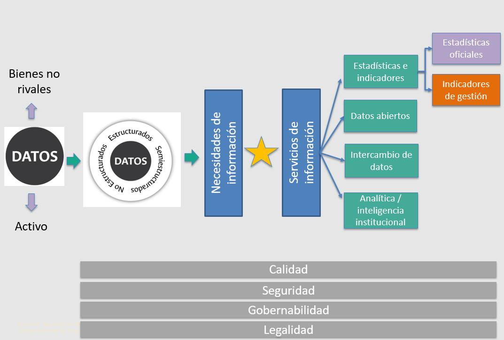

# Modelo de gestión de la información en la Universidad Nacional de Colombia

La gestión de la información disponible al interior de las organizaciones en general y de las universidades en particular es uno de los grandes retos que estas enfrentan en la actualidad. ¿Cómo entender la categoría información a nivel institucional?, ¿de qué tipo de datos estamos hablando a la hora de gestionar la información?, ¿qué datos poseemos, quién los administra y qué calidad presentan?, ¿quién es el dueño de los datos y bajo qué parámetros o reglas estos pueden ser gestionados?, ¿los diferentes tipos de datos existentes en las organizaciones implican formas diferentes para su gestión?, ¿qué productos o servicios se pueden derivar a partir de una correcta gestión de la información disponible?, ¿qué papel desempeñan las estadísticas y los indicadores de gestión, por ejemplo, en el ámbito de la información institucional?, etc. son algunas de las preguntas que enfrentan en la actualidad aquellas organizaciones que consideran sus datos como un activo institucional y su correcta gestión como uno de las acciones a desarrollar.

En este contexto, la Universidad Nacional de Colombia, durante los últimos años [^1]  y, en especial, a partir del actual Plan Global de Desarrollo 2019-2021 *“Proyecto Cultural y Colectivo de Nación”*, de la reciente creación de la Dirección Nacional de Estrategia Digital DNED y dentro de esta, con la creación de la Oficina de Gestión de la Información, no sólo ha considerado sus datos como un activo institucional, sino que ha venido generando las condiciones para una correcta gestión de los mismos. En este contexto, en la actualidad la institución se encuentra en el proceso de construcción y disposición de un modelo que oriente la gestión de la información disponible a nivel institucional en donde, los indicadores de gestión, que conforman el objeto de esta guía, tienen un espacio definido. 

[^1]: Ejemplos de esta importancia, en años anteriores, por ejemplo, se ven reflejados en la gestión de la información estadística la cual, además de venirse desarrollando de manera permanente en la Universidad desde aproximadamente el año 1965, se formalizó durante los últimos años con la creación de la Oficina Nacional de estadística adscrita a la Dirección Nacional de Planeación y Estadística. No menos importante, ha resultado la importancia que se le ha dado a la medición a nivel institucional y en términos de gestión desde que esta incursionó en la implementación de su Sistema de Calidad (antes llamado SIMEGE y hoy denominado SIGA).

La Figura \@ref(fig:figura2), presenta una primera aproximación a los componentes, los instrumentos y las herramientas que hacen parte de una primera propuesta de modelo para la gestión de la información a nivel institucional. Este modelo, como se observa en la Figura, inicia con la importancia de entender los datos como un bien/activo institucional que presenta, desde una perspectiva económica, una característica de no rivalidad [^2]. En segundo lugar, los datos en la actualidad pueden ser clasificados en: estructurados, semiestructurados y no estructurados. 

[^2]: Un bien no rival es aquel cuyo uso para un propósito no impide que los mismos sean utilizados para otros propósitos. Desde luego, los datos, al poderse emplear en múltiples propósitos, los hace bienes o activos de tipo no rival.

Las diferentes tipologías de los datos se materializan a nivel de la Universidad en necesidades o demandas de información las cuales pueden ser de tipo externo, internos e incluso algunas para las cuales aún no existen datos disponibles. Para dar respuesta a las necesidades actualmente existentes a nivel institucional en materia de información, en principio y como se observa en la parte derecha de la Figura \@ref(fig:figura2), se propone que el modelo de gestión de la información institucional esté conformado por 4 servicios de información: estadísticas e indicadores, datos abiertos, intercambio de datos y el servicio de analítica e inteligencia institucional.

El modelo propuesto a su vez está atravesado por 4 componentes transversales que impactan la gestión de la información en la Universidad. La calidad de los datos disponibles y su aseguramiento en el futuro, la seguridad de los datos y de la información institucional, la gobernabilidad de los datos disponibles, así como el reconocimiento de los aspectos legales involucrados a la hora de gestionar datos, se convierten en 4 elementos que atraviesan la gestión de la información institucional.

```{r figura2, echo=FALSE, out.width='100%', fig.align='center', fig.cap='Modelo de Gestión de la Información en la UNAL'}

```

Los indicadores de gestión, que hacen parte del objeto de esta guía, en el marco de la gestión de la información institucional (*Ver Figura \@ref(fig:figura2): Modelo de Gestión de la Información en la UNAL*) se ubican en el contexto de los servicios de información institucional propuestos y, en específico, dentro del componente de estadísticas e indicadores institucionales.
