# Metodología para la definición de indicadores de gestión en los procesos de la UNAL

En múltiples escenarios se ha reconocido el uso de los indicadores de gestión como una de las formas más simples en las que cualquier entidad puede transformar sus datos en información útil para la toma de decisiones, debido principalmente a su enorme capacidad para comunicar el grado de cumplimiento de metas y objetivos institucionales. De ahí parte la necesidad de establecer a nivel institucional un método claro y estructurado que permita la cuantificación, medición y seguimiento al desempeño de los procesos, a través de instrumentos objetivos, sin perder de vista el enorme desafío que representa el separar los datos útiles de los irrelevantes, debido a los altos volúmenes de información que se generan constantemente en la operación cotidiana de la Universidad.

Es por esto que a través de una revisión sistemática de referentes como el Departamento Administrativo de la Función Pública DAFP, el Departamento Administrativo Nacional de Estadística DANE, el Departamento Nacional de Planeación DNP, la Comisión Económica para América Latina y el Caribe CEPAL y el Consejo Nacional de Evaluación de la Política de Desarrollo Social CONEVAL de México, se presenta el método para la formulación y aplicación de los indicadores de gestión en los procesos adoptado por la UNAL, compuesto por 6 fases secuenciales (*Ver Figura  \@ref(fig:figura3): Diagrama de flujo para la cuantificación, medición y seguimiento a la gestión de los procesos UNAL*) que se detallan en los siguientes apartados de la presente guía:

```{r figura3, echo=FALSE, out.width='70%', fig.align='center', fig.cap='Diagrama de flujo para la cuantificación, medición y seguimiento a la gestión de los procesos UNAL'}
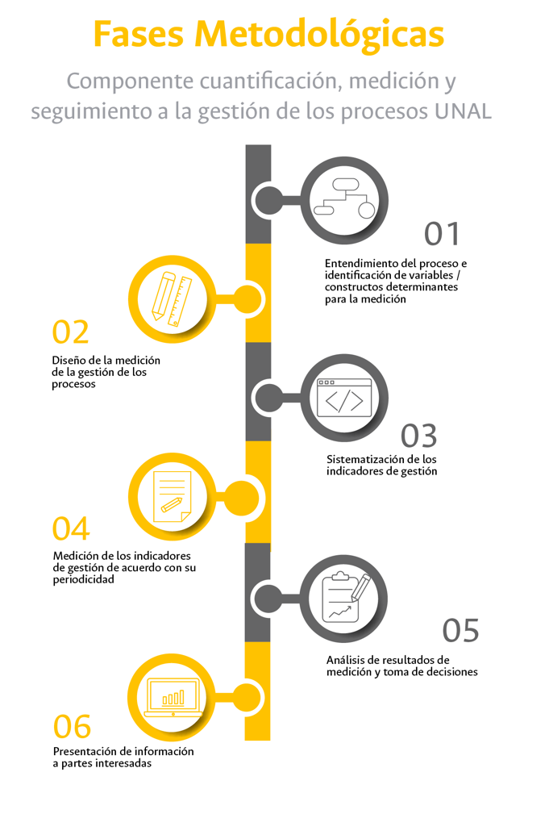
```

## Entendimiento del proceso e identificación de variables observables y no observables determinantes para la medición

Antes de iniciar con la definición de los indicadores de gestión asociados a un proceso en particular, es necesario hacer un análisis exhaustivo de aquello que se pretende medir. Por lo que se requiere un entendimiento de dicho proceso desagregándolo en sus diferentes componentes, los cuales se encuentren definidos en las siguientes fuentes de información:

*	Caracterización de proceso: En este documento se presenta el objetivo con el cual se establece la intensión y finalidad hacia la que se dirigen los recursos y esfuerzos involucrados en su operación de manera descriptiva y concreta, al tiempo que se describen sus entradas o insumos requeridos, los productos o servicios que se espera obtener, las diferentes fases del ciclo PHVA y los responsables de su ejecución.

*	Las metas y resultados que se propone alcanzar los cuales se encuentran inmersos tanto en los procedimientos como en planes y proyectos.

*	Las herramientas tanto informáticas como documentales (formatos) en las que se registran los datos que dan cuenta de la ejecución del proceso para establecer posibles fuentes de información.

*	La caracterización de usuarios y partes interesadas en la que se establecen cuales son sus grupos de interés con sus necesidades y expectativas, así como los productos y servicios esperados.

*	La matriz DOFA con el análisis de contexto en el que se enuncian sus debilidades, oportunidades, fortalezas y amenazas. En la esfera externa del proceso se pueden identificar las habilidades que se requieren para se exitoso, mientras que a nivel interno se pueden identificar las situaciones que pueden influir en su éxito o fracaso.

*	El normograma con la normativa aplicable en la que se establecen aquellos aspectos que el proceso debe cumplir en términos legales.

Una vez se tiene claridad de las características del proceso en particular, se requiere establecer cuales variables observables y no observables son determinantes para su medición, es decir, cuales son los atributos, aspectos o condiciones tanto internas como externas que se pueden influenciar a través de decisiones al tiempo que afectan significativamente el cumplimiento de su objetivo. En otras palabras, se podría decir que si los objetivos son los fines hacia los cuales se dirigen los esfuerzos y recursos institucionales, las variables observables y no observables determinantes para su medición son los medios a través de los cuales dichos fines se logran.

A partir de este análisis es posible obtener un listado de aspectos más o menos numeroso, el cual debe ser priorizado y calificado en relación con la relevancia que tiene para el proceso con el fin de decantar la información inicial y enfocarse en aquellos que tiene mayor incidencia en su desempeño global. Para lograrlo se debe evitar que las variables resultantes contengan elementos redundantes y procurar porque sean coherentes entre si para lograr un balance entre la cantidad y la calidad de la información.

En la práctica, para el desarrollo de esta fase se requerirán sesiones de trabajo con funcionarios involucrados en el proceso, quienes de acuerdo con su nivel de experiencia y conocimiento podrán aportar a la construcción del listado de variables observables y no observables y su posterior depuración, las cuales serán usadas como punto de partida para la definición de los indicadores de gestión. 

Si bien las variables observables y no observables determinantes de medición son específicas para cada objetivo de proceso y cada tipo de entidad a continuación, se enuncian posibles categorías en las que estas se pueden clasificar acompañadas de ejemplos relacionados con el contexto de la Universidad: 

*	*Tiempo:* Oportunidad en la prestación del servicio.

*	*Cobertura:* Incremento en el número de estudiantes matriculados, número de beneficiarios de programas de bienestar, número de usuarios de un servicio específico.

*	*Financiero:* Costos de operación.

*	*Cumplimiento:* Avance en las acciones o actividades programadas, ejecuciones de actividades específicas.

*	*Calidad:* Número de devoluciones, reprocesos, acreditación de programas curriculares, incumplimiento de estándares o especificaciones.

*	*Cantidad:* Productos de investigación, publicaciones, patentes.

*	*Constructos o conceptos:* Competencia del talento humano, comunicación organizacional, desarrollo y desempeño docente.

*	*Otras:* Deserción estudiantil, repetición de materias, alianzas interinstitucionales y empresariales, intercambio estudiantil o docente.

Así mismo en la Figura \@ref(fig:figura4) se proponen 4 perspectivas o dimensiones en las que se podría enmarcar el desempeño de un proceso en la UNAL (véase @bolborici2012aplicacion) , de tal manera que se pueda hacer un análisis desde múltiples puntos de vista para traducir sus objetivos en acciones concretas y medibles orientadas a la creación de valor, facilitando la identificación de las variables determinantes de medición:

```{r figura4, echo=FALSE, out.width='60%', fig.align='center', fig.cap= 'Perspectivas para la ubicación de las variables determinantes de medición '}
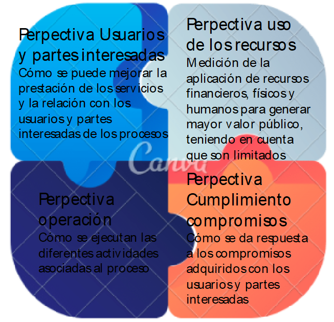
```

En el [anexo 1](#anexos) de esta guía se propone un método de evaluación de la criticidad de las variables determinantes de medición para su priorización de acuerdo con tres criterios como son el impacto que la variable tiene sobre el objetivo del proceso, la confiabilidad de los datos para su medición y el último es la capacidad de gestión sobre la variable. Este método podrá utilizarse para facilitar la selección de variables asociadas a un proceso en caso de tener un listado numeroso.

Por otra parte conviene mencionar en este apartado que en los diferentes modelos estudiados para la construcción de esta guía se presentan diversas estructuras para la clasificación de los indicadores de gestión, como el caso de la Función @publica2015guia, que muestra un enfoque desde la visión de la cadena de valor, donde se ubican las tipologías de indicadores de acuerdo a su relación con cada eslabón de dicha cadena (*Ver figura \@ref(fig:figura5): Categoría de indicadores de acuerdo a su ubicación en la cadena de valor público propuesta por el DAFP*). En esta jerarquía se proponen indicadores desde el punto de vista del desempeño (economía, eficiencia, eficacia, efectividad y calidad), y desde el punto de vista de resultados (insumo, proceso, producto, resultados finales e impacto) asociados a un flujo de información que se dirige en el sentido de la operación de los procesos (de izquierda a derecha).

```{r figura5, echo=FALSE, out.width='85%', fig.align='center', fig.cap='Categoría de indicadores de acuerdo a su ubicación en la cadena de valor público propuesta por el DAFP'}
knitr::include_graphics('Imagenes/figura_5.png')
```
Tomado de @publica2015guia.

De modo similar la guía del Departamento Nacional de Planeación (@sanchez2018guia)  propone una clasificación de los indicadores asociada a la cadena de generación de valor público (*Ver figura \@ref(fig:figura6): Categorías de indicadores con base en la cadena de valor de acuerdo al DNP*), donde se relacionan los insumos (factores de producción) con actividades a través de las cuales sufren un proceso de transformación para la generación de bienes o la prestación de servicios (productos) que finalmente conllevan al bienestar de los usuarios finales (resultados). La estructura de esta categorización de indicadores es tipo embudo en la que se inicia de arriba hacia abajo con tipologías que van de mayor a menor complejidad en su estructura.

```{r figura6, echo=FALSE, out.width='70%', fig.align='center', fig.cap='Categorías de indicadores con base en la cadena de valor de acuerdo con el DNP'}
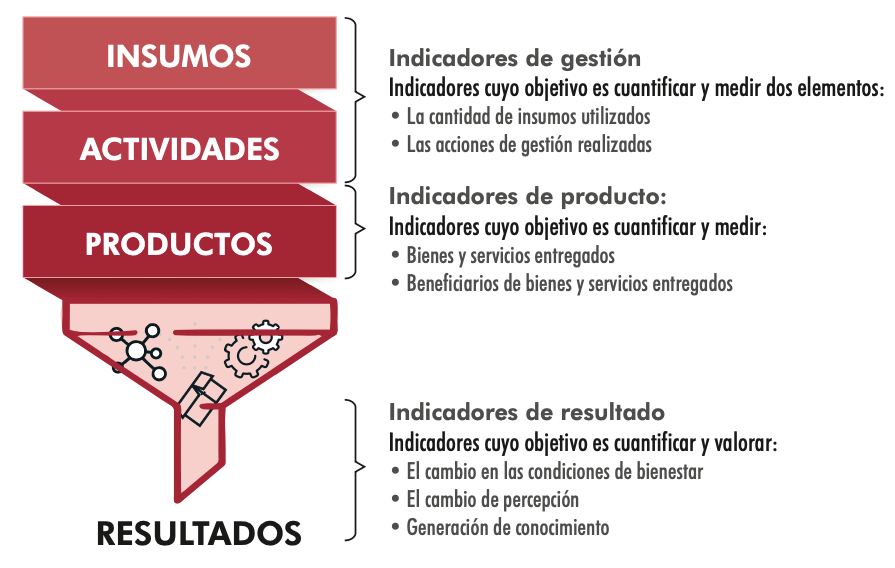
```

Tomado de @sanchez2018guia.

Por su parte, la guía para la construcción de indicadores del DANE, según @dane2014guia establece que existen cuatro tipos de clasificaciones comunes: según medición, nivel de intervención, jerarquía y calidad (*Ver figura \@ref(fig:figura7): Interrelación entre indicadores, según nivel de resultados y jerarquía*), haciendo la salvedad que no son excluyentes entre si y que se pueden usar de acuerdo con las necesidades de los procesos estadísticos de las entidades. Los indicadores según su medición se categorizan en cuantitativos y cualitativos, en cuanto al nivel de intervención se dispone de las tipologías impacto, resultado, producto, proceso e insumo, según la jerarquía se tienen indicadores de gestión y estratégicos y finalmente se tienen las categorías de indicadores según la calidad como son eficacia, eficiencia y efectividad. En este caso la estructura es piramidal de abajo hacia arriba del menos al más estratégico de acuerdo con su relación con la jerarquía de los objetivos de la entidad.

```{r figura7, echo=FALSE, out.width='70%', fig.align='center', fig.cap=': Interrelación entre indicadores, según nivel de resultados y jerarquía'}
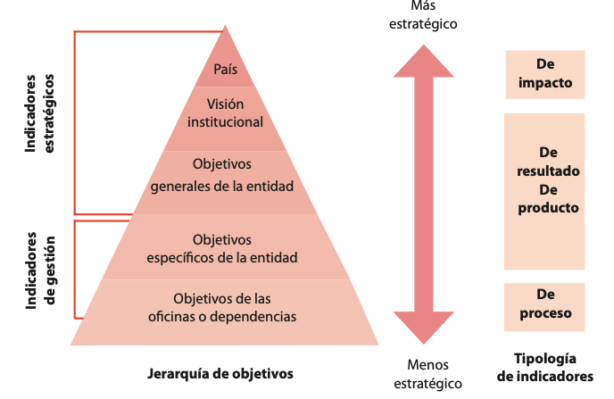
```

Tomado de @dane2014guia.

Como otro referente se tiene la taxonomía propuesta por la CEPAL en su manual de indicadores para el sector público  que incluye dos formas de clasificación diferentes (véase @bonnefoy2005indicadores), la primera a indicadores desde el punto de vista de la actuación pública en la generación de productos como son insumo, procesos o actividades, productos y resultados finales y la segunda los cataloga de acuerdo con el desempeño es estas actuaciones en las dimensiones de eficiencia, eficacia, calidad y economía. Gráficamente esta distribución se presenta como una red de interrelaciones entre ambas categorías de indicadores desde la perspectiva del proceso productivo integrado a los niveles de servicio, al uso de recursos y la satisfacción de los usuarios (*Ver figura \@ref(fig:figura8): Taxonomía de indicadores desde la perspectiva del proceso productivo según CEPAL*).

```{r figura8, echo=FALSE, out.width='70%', fig.align='center', fig.cap=': Taxonomía de indicadores desde la perspectiva del proceso productivo según CEPAL'}
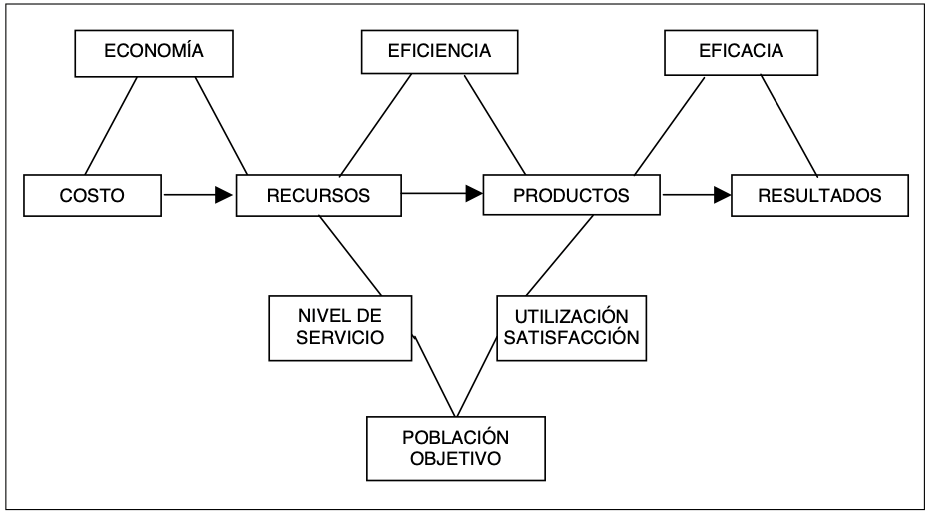
```

Tomado de @bonnefoy2005indicadores.

Finalmente, según @coneval2013manual considera cuatro dimensiones de desempeño: eficacia, eficiencia, calidad y economía que permiten medir el cumplimiento de un objetivo en relación con el nivel de logro que se espera alcanzar, de tal manera que el análisis desde diversos ángulos muestre una valoración integral del mismo (*Ver figura \@ref(fig:figura9): Dimensiones sugeridas de los indicadores CONEVAL*). Este enfoque relaciona los momentos en los que se realiza la medición (cuándo) con aquello que se está midiendo (qué) para establecer que tipo de indicador es recomendable.

```{r figura9, echo=FALSE, out.width='70%', fig.align='center', fig.cap=' Dimensiones sugeridas de los indicadores CONEVAL'}
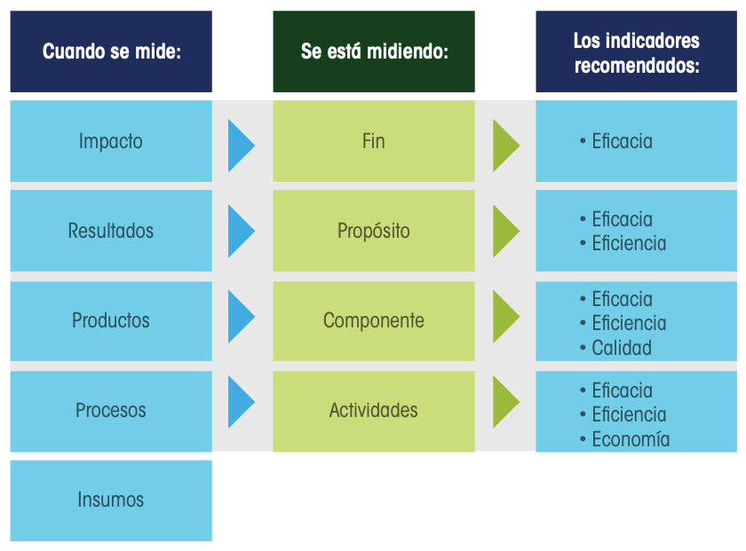
```

Tomado de @coneval2013manual. 

```{r, echo=FALSE, out.width='70%', fig.align='center'}
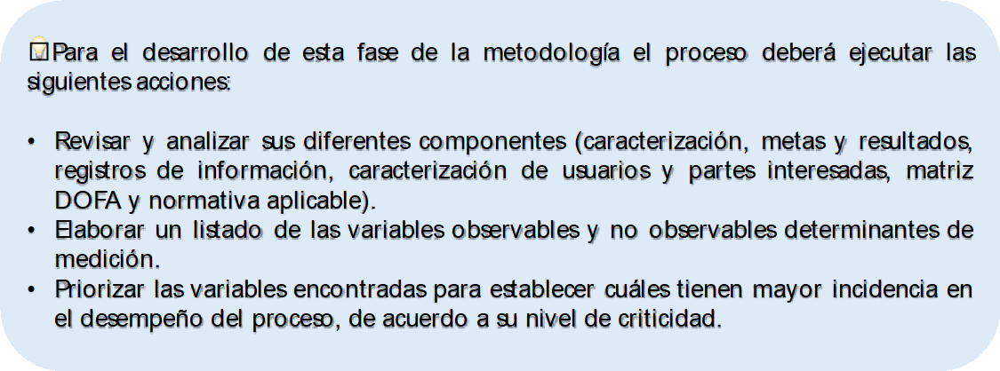
```

## Diseño de la medición de la gestión de los procesos

La medición del desempeño de los procesos supone un esfuerzo institucional en la obtención de información de calidad que sea útil tanto para la toma de decisiones como para la rendición de cuentas a las partes interesadas, por lo que se deben establecer claramente cuales son los parámetros que permitan la caracterización de los indicadores de gestión en cuanto a su función, contexto y forma de uso. Para el caso de la UNAL se tomarán en cuenta los siguientes atributos: 

### Fórmula del indicador

Un aspecto importante al momento de diseñar un indicador consiste en establecer la relación matemática de las variables determinantes para su medición, con el fin de realizar el cálculo correspondiente y así obtener su valor cuantitativo. Para esto se requiere expresar el indicador a través de una ecuación en la que se utilizan símbolos para las expresiones aritméticas que denotan las operaciones matemáticas asociadas ($\div$, $\times$, $+$, $-$, $()$), en lugar de palabras (suma, resta, multiplicación, división, asociación, etc), así como identificadores ($X$, $Y$, $Z$, etc.) para nombrar las variables determinantes de medición que la componen. Para ilustrar lo anterior, a continuación (*Ver Figura \@ref(fig:figura10): Ejemplo fórmula de un indicador de gestión asociado a un proceso de la UNAL*) se muestra un ejemplo del cómo se debe escribir la fórmula asociada a un indicador de proceso:

```{r figura10, echo=FALSE, out.width='70%', fig.align='center', fig.cap='Ejemplo fórmula de indicador de gestión asociado a un proceso de la UNAL'}
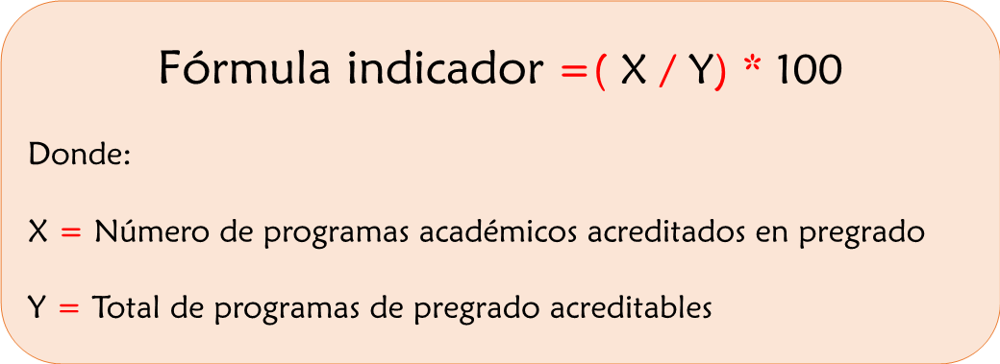
```

### Tipos de formulación de indicador

* **Frecuencia Absoluta (Cantidad):**
  Representa el número de veces que un valor $x_i$ está en un conjunto de valores $(x_1, x_2, x_3, …, x_n)$. Se calcula a partir del recuento de la variable estudiada para ver el número de veces que aparece en el universo de datos:
  
$$
\sum_{i=1}^{k}x_i=x_1+x_2+\cdots+x_k=X
$$

```{r, echo=FALSE, out.width='70%', fig.align='center', fig.cap='Ejemplo'}
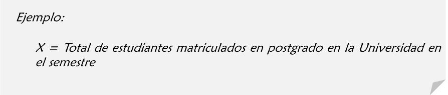
```

* **Frecuencia Relativa (Proporción):**
  De acuerdo con lo que establece @coneval2013manual, el porcentaje expresa un número como partes de cada cien. En términos de frecuencia relativa representa la proporcionalidad de una parte respecto al todo que generalmente esta dividido en $n$ partes (100, 1000, etc.). Se calcula a partir del cociente entre dos variables con una misma unidad de medida en un periodo de tiempo determinado. A continuación, se muestra con un ejemplo la formulación de este tipo de indiciadores:
  
```{r, echo=FALSE, out.width='90%', fig.align='center', fig.cap='Ejemplo indicador formulado como porcentaje'}
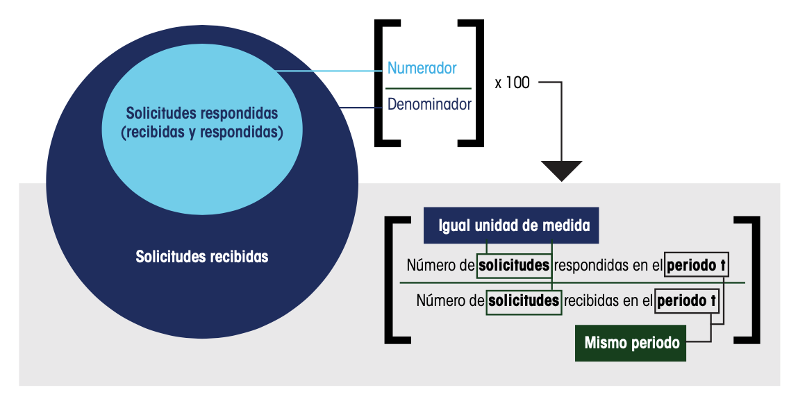
```

Tomado de @coneval2013manual.

```{r, echo=FALSE, out.width='70%', fig.align='center'}
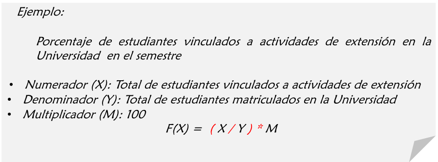
```

* **Tasa de variación:**
  Según @coneval2013manual, este tipo de medida expresa un cambio relativo en el tiempo a través del cociente de dos observaciones de una misma variable en diferentes periodos de tiempo (pasado $(t-k)$ y presente $(t)$) para establecer si hubo un incremento o decremento de esta. Para su cálculo el periodo más reciente $(t)$ se coloca en el numerador mientras que el menos reciente se ubica en el denominador $(t-k)$.
  
```{r, echo=FALSE, out.width='90%', fig.align='center', fig.cap='Ejemplo indicador formulado usando el método tasa de variación'}
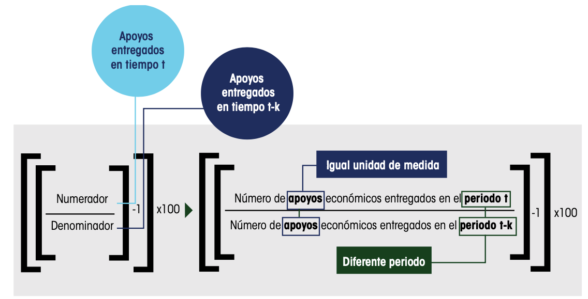
```

Tomado de @coneval2013manual.

* **Razón (Promedio):**
  Según @coneval2013manual,  la define como el cociente entre dos variables en un periodo de tiempo determinado a través de la cual se expresa un tanto de unidades del numerador por cada unidad del denominador. El promedio es una particularidad de la razón en la que se tiene la suma finita de un conjunto de valores dividida entre el número de sumandos. Para su cálculo se tienen dos variables con diferentes unidades de medida, asociadas a un mismo periodo de tiempo. 
  
```{r, echo=FALSE, out.width='90%', fig.align='center', fig.cap='Ejemplo indicador formulado usando el método razón'}
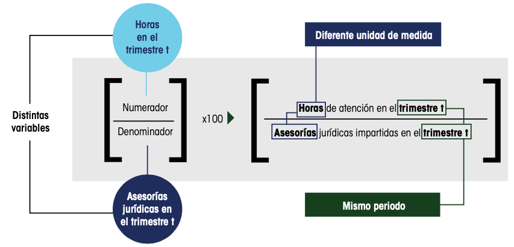
```

Tomado de @coneval2013manual.

```{r, echo=FALSE, out.width='70%', fig.align='center'}
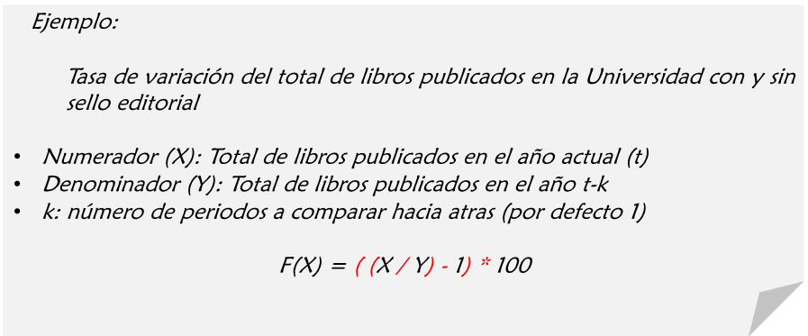
```

* **Índice:**
  Tal como especifica @coneval2013manual, se trata de una medida estadística que estudia las variaciones de una o más magnitudes en relación con el tiempo o el espacio.
  
Una vez definida la forma de cálculo del indicador es necesario establecer la direccionalidad de la medición, con lo cual se hace referencia a la dirección o rumbo del resultado obtenido pudiendo establecer si se cumple o no con lo esperado. Este sentido puede ser:

*	**Ascendente:** Lo cual implica que la meta siempre es igual o mayor a la línea base o punto de referencia y que un buen desempeño se logra cuando el resultado de la medición del indicador aumenta de un periodo a otro. 

*	**Descendente:** En este caso la meta se encuentra por debajo de la línea base y se espera que la medición del indicador vaya reduciéndose para mostrar el desempeño deseado.

*	**Regular:** Este sentido se da cuando el resultado esperado se debe mantener dentro de un determinado rango de desempeño (límite inferior y superior) y no cuenta con un valor puntual de meta.

### Nombre del indicador

Al formular indicadores de gestión es importante tener en cuenta que su principal objetivo es medir los signos vitales de los procesos a partir de variables observables y no observables determinantes de medición, las cuales deben ser lo suficientemente relevantes para garantizar que de su monitoreo dependa la supervivencia institucional.

Por lo anterior, es recomendable nombrar el indicador de una manera clara, precisa y auto explicativa, de tal forma que logre distinguirse del universo de mediciones de la Universidad sin correr el riesgo de confundirse en una enorme cantidad de información. El nombre del indicador le dará una identidad propia por lo que debe resultar lo mas ilustrativo posible con relación a lo que se quiere medir, de manera que a continuación se sugiere una estructura de redacción compuesta por 5 elementos que lo caracterizan:

  
```{r, echo=FALSE, out.width='90%', fig.align='center', fig.cap='Fórmula para nombrar un indicador de gestión'}
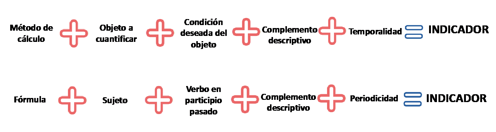
```

A partir de la aplicación de la fórmula propuesta se tiene los siguientes ejemplos de nombres para indicadores de gestión aplicables a los procesos de la Universidad:

```{r, echo=FALSE, out.width='90%', fig.align='center'}
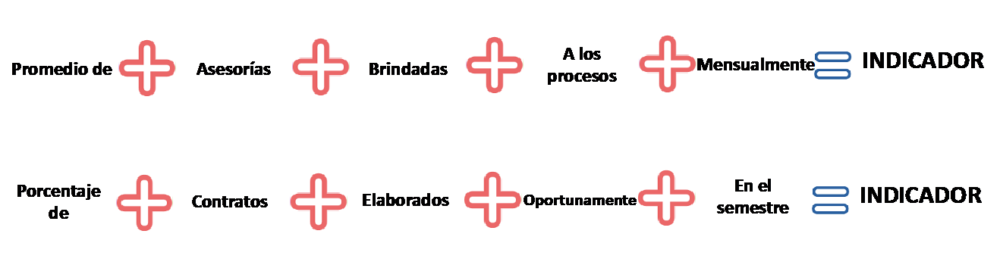
```

```{r, echo=FALSE, out.width='90%', fig.align='center', fig.cap='Ejemplos nombres indicadores de gestión aplicables en la UNAL'}
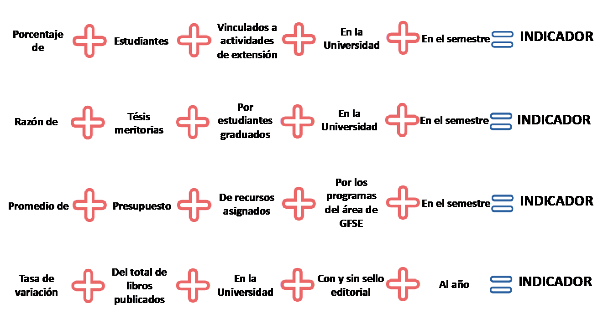
```

Tomado de @publica2015guia.

Una vez se tenga claro el nombre del indicador se hará una descripción de este, en la que se justifique la importancia de su existencia en relación con el proceso que busca explicar sin que se incluyan los elementos mencionados en la anterior fórmula para no ser redundantes.

### Fuentes de información

Continuando con el diseño de la medición se debe determinar el origen a partir del cual se obtendrán los datos puntuales que representan las variables asociadas al indicador, así como su localización y el método para su recolección. Para la Universidad se tiene una variedad de fuentes de información entre otros los que se destacan los siguientes tipos:

* Cifras oficiales: Estadísticas oficiales que se encuentran publicadas en los siguientes sitios web:  [Estadísticas UNAL, ](http://estadisticas.unal.edu.co/home/)[ Cifras UNAL sede Bogotá, ](http://estadisticas.unal.edu.co/menu-principal/cifras-sedes/bogota/)[ Cifras UNAL sede Medellín, ](http://estadisticas.unal.edu.co/menu-principal/cifras-sedes/bogota/, http://estadisticas.unal.edu.co/menu-principal/cifras-sedes/medellin/)[ Cifras UNAL sede Manizales, ](http://estadisticas.unal.edu.co/menu-principal/cifras-sedes/manizales/)[ Cifras UNAL sede Palmira](http://estadisticas.unal.edu.co/menu-principal/cifras-sedes/palmira/, )[ Cifras UNAL sede Orinoquía, ](https://estadisticaun.github.io/BoletinOrinoquia/)[ Presupuesto UNAL, ](http://gerencia.unal.edu.co/index.php?id=134)[ Memoria Financiera, ](http://gerencia.unal.edu.co/index.php?id=147)[ Indicadores - Vicerrectoría de Investigación. ](http://cifrasvri.unal.edu.co/)

* Registros de tipo administrativo que se pueden encontrar en sistemas de información institucionales (SARA, SIA, QUIPU, HERMES, SIBU, SINAB, SINSU, SoftExpert), bases de datos propias o en documentos tanto propios del proceso como de terceros bien sea en formatos, informes, archivos físicos o electrónicos.

Después de tener claridad sobre la ubicación de los datos fuente, así como de su disponibilidad para el uso, se debe definir el proceso de recolección de estos de acuerdo con la periodicidad de medición que se determine para cada indicador. Este proceso puede consistir en una consulta de un sistema de información o página web, la revisión de informes de gestión o de registros en medio físico o electrónico, el diligenciamiento de formularios o encuestas los cuales contengan los valores puntuales de las variables determinantes de medición o también se puede realizar por observación directa. Cabe aclarar que las fuentes de información no son las dependencias o procesos donde se generan los datos, ni los responsables de procesarla, consolidarla y presentarla.

El procesamiento incluye las operaciones necesarias para transformar los datos en información útil bien sea a través de procesos manuales como registro y clasificación o a través de procesos automáticos que incluyen filtrado, análisis, visualización y tabulación. En muchos casos se deberá fortalecer el registro administrativo de información bien sea en medios físicos o electrónicos para afinar las fuentes de datos antes de su procesamiento, porque es posibles que no existan los medios dispuestos para su captura.

### Periodicidad de medición

No existe un estándar para establecer con qué periodicidad se requiere medir un indicador específico, lo importante es que dicha periodicidad tenga sentido para el proceso asociado, de ahí que la frecuencia seleccionada permita entregar información oportuna para la toma de decisiones y este relacionada con la disponibilidad (fuente de los datos) y accesibilidad de la información de entrada para su cálculo, así como el nivel de complejidad de la medición.

Si bien no se puede establecer el intervalo de tiempo ideal para el registro de los datos asociados a los indicadores de gestión, se recomienda que no sea tan estrecho (diario) que implique un desgaste institucional para los responsables designados, ni tan amplio (años) que impida generar alertas tempranas frente a cambios en el comportamiento del proceso. Al final la medición del indicador de gestión debe reflejar la realidad de aquello que busca explicar, en este caso, el cumplimiento del objetivo del proceso.

Es importante tomar conciencia que al establecer una frecuencia de medición se crea un compromiso por parte del responsable designado tanto para la actualización de la información como para la entrega oportuna de resultados a las partes interesadas, en pro de mostrar transparencia en la gestión de los procesos y como parte del ejercicio de rendición de cuentas permanente.

### Línea base

Antes de establecer metas o rangos de desempeño es fundamental tener un punto de referencia en el momento cero de la medición del indicador con el que se pueda evidenciar el avance o retroceso de la gestión respecto al cumplimiento del objetivo del proceso asociado. En la mayoría de los casos se trata de un valor inicial del indicador, es decir el valor que toman las variables de cálculo en un periodo determinado, aunque también es posible calcularlo a partir del promedio de los valores que ha tomado en diferentes periodos en el pasado si se cuenta con suficientes datos históricos e incluso puede llegar a ser cero como en el caso de la ejecución de un proyecto.

La línea base se usa principalmente para fijar la meta de un indicador cuando no se tiene clara una apuesta a futuro, un estándar o valor de referencia (normativo o de la competencia), teniendo en cuenta que a partir de esta información se pueden hacer predicciones sobre el comportamiento del proceso a lo largo del tiempo. En este caso la meta podrá ser igual a la línea base o bien estar ubicada unos puntos por encima o por debajo dependiendo de la tendencia del indicador (ascendente, descendente o regular). 

Los datos asociados a la línea base son útiles en la medida en que informan a los responsables de los procesos sobre las circunstancias actuales antes de proyectarse hacia el cumplimiento de metas, de esta manera se obtiene un aprendizaje de los niveles actuales y patrones de desempeño, resolviendo problemas de improvisación en la planeación. En otras palabras, la utilidad de la línea base consiste en conocer como estamos hoy para saber a donde queremos llegar mañana.

### Establecimiento de rangos de desempeño o metas

La expresión concreta y cuantificable de los logros previstos en un horizonte de tiempo determinado con relación al cumplimiento del objetivo de un proceso, es lo que se denomina meta o rango de desempeño. En el caso de las entidades públicas algunas de estas metas están asociadas a obligaciones dadas por la norma o entes reguladores, mientras que otras dependen bien sea de apuestas a futuro propias, valores de referencia basados en resultados de competidores líderes o en análisis de datos históricos (línea base). Es importante aclarar que cuando el logro de los resultados está dado por una meta tendrá un valor puntual el cual podrá ser fijo o variable en el tiempo dependiendo de la estabilidad del proceso, mientras que cuando se trata de un rango de desempeño se deberá fijar un límite inferior y un límite superior entre los cuales se espera se mantengan las mediciones del indicador.

En cualquiera de los dos escenarios anteriormente expuestos se requiere que el nivel de desempeño a alcanzar puntual o rango, sea realista al tiempo que represente un desafío significativo para los responsables del despliegue del proceso, para no caer en extremos, de tener indicadores con cumplimientos por encima de la meta o indicadores que nunca pueden alcanzarla, esto garantizará que el valor fijado sea razonable.

Teniendo en cuenta esto, se recomienda que una vez el indicador haya mostrado un cumplimiento recurrente del desempeño esperado se revisen las metas o los rangos propuestos con el fin de ajustarlos y llevarlos a nuevos niveles más retadores para el proceso o si es el caso tomar la decisión de suspender su medición debido a que se ha cumplido su ciclo de vida (vencimiento). De igual forma se deben revisar las metas o rangos de desempeño cuando el indicador tenga un incumplimiento periódico, porque podría ser un síntoma de que los resultados previstos no son realistas y no es posible alcanzarlos con los recursos financieros, humanos, físicos y tecnológicos de los cuales dispone el proceso.

### Hoja de vida de indicador (Ficha técnica)

Este instrumento brinda información valiosa relacionada con un indicador específico caracterizándolo de tal manera que cualquier parte interesada pueda conocer detalladamente los atributos que responden a las preguntas qué, quién, cuándo, dónde, para qué y cómo de la siguiente manera:

*	*Nombre:* Claro, sencillo y autoexplicativo.
*	*Descripción:* Objetivo del indicador en relación con el proceso que pretende medir.
*	*Proceso:* Nombre y código según los que establece el mapa de procesos vigente en la UNAL.
*	*Nivel de aplicación:* Nivel Nacional, Sede, Facultad, Centro, Instituto y Laboratorios.
*	*Cobertura del indicador:* Único (S/N).
*	*Variables determinantes de desempeño:* Atributos a partir de los cuales se calcula el indicador. Hay que tener en cuenta que, en caso de usarse siglas para nombrar las variables, se debe hacer una nota explicativa para su descripción con el fin de que cualquier parte interesada comprenda a que hacen referencia.
*	*Fuentes de información:* Ubicación de los datos que serán usados para las mediciones periódicas del indicador.
*	*Tipo de formulación:* Forma de calculo del indicador (frecuencia absoluta, proporción, tasa de variación, razón, etc.).
*	*Fórmula:* Expresión matemática usada para obtener el valor cuantitativo del indicador.
*	*Unidad de medida:* Parámetro de referencia con el cual se determina la magnitud del indicador.
*	*Periodicidad de medición:* Frecuencia con la que se recolectan los datos de entrada, se realiza el cálculo del indicador y se analizan los resultados.
*	*Rango de desempeño o Meta:* Cantidad que se espera alcanzar en un periodo determinado o rango previsto dentro del que se espera mantenerse en un periodo de tiempo.
*	*Responsable de medición:* Instancia y cargo del funcionario que debe registrar la información correspondiente a los valores cuantitativos del indicador con su análisis y acciones en caso de que se requiera.
*	*Línea base (si aplica):* Información que permite describir el estado en que se encuentra el indicador en el momento cero de la medición.
*	*Fecha de creación:* Corresponde al momento en que se formula y entra en vigencia el indicador.

La totalidad de la información asociada al indicador se podrá sistematizar de acuerdo con lo que se establece en el siguiente apartado.

```{r, echo=FALSE, out.width='80%', fig.align='center'}
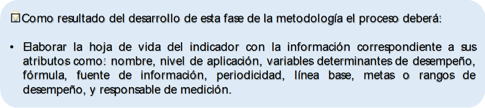
```


