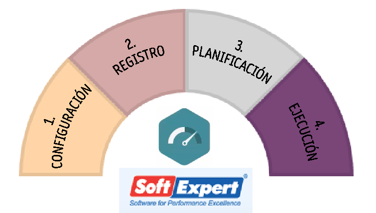
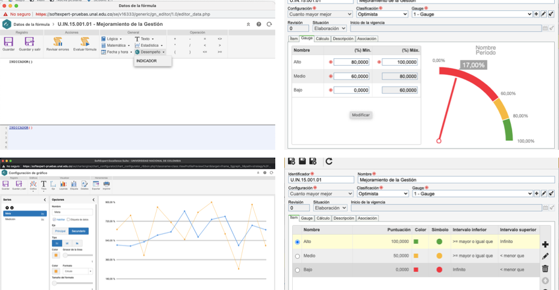
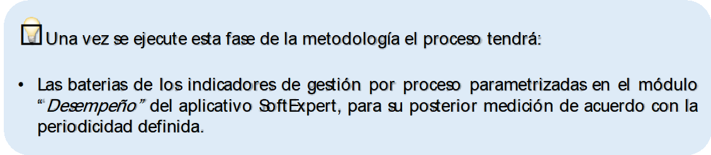

# Sistematización de los indicadores de gestión

La Universidad Nacional cuenta con un software de tipo modular para la gestión integrada de la información asociada al Sistema Integrado de Gestión Académica, Administrativa y Ambiental SIGA, en el que se incluye el módulo de *“Desempeño”*, con el cual se administran y monitorean los indicadores de gestión asociados a los procesos, contemplando a grandes rasgos las siguientes actividades:

```{r, echo=FALSE, out.width='70%', fig.align='center', fig.cap='Fases para la sistematización de indicadores de gestión módulo *“Desempeño”*'}

```

1.	**Configuración inicial** del módulo de acuerdo a la metodología adoptada por la UNAL que incluyen la programación de mediciones periódicas de las baterías de indicadores, registro de metadatos (atributos asociados a los indicadores), niveles de responsabilidad (grupos de usuarios responsables de ejercer diferentes funciones), configuración de eventos (problema, incidente, plan de acción) a partir de reglas predefinidas, rango de desempeño, visualización gráfica de la medición del indicador, jerarquía de indicadores, unidades de medida, perfil de visualización (estructura de la batería de indicadores, historial del resultado del indicador, detalles del indicador y listado de indicadores), tipos de análisis gráficos.

2.	**Registro de información** que será utilizada en el momento de la planificación, ejecución y gestión de las baterías de indicadores como elementos institucionales (perspectivas, objetivos, áreas, sedes, procesos, visión, misión y valores, entre otros), factores críticos de éxito (variables determinantes de desempeño), indicadores de gestión, matriz de decisión, matriz DOFA, modelo de las baterías de indicadores.

3.	**Planificación de la estructura de las baterías de indicadores** asociando elementos institucionales (perspectivas, objetivos, procesos), matriz de decisión, matriz DOFA, documentos referentes, plan de acción, controles, riesgos, factores críticos de éxitos (variables determinantes de desempeño), indicadores de gestión, fórmulas de cálculo, metas, responsabilidades en cada nivel de aplicación, plazos de reporte de mediciones, definición de análisis gráfico comparativo con otros periodos de medición o con otros indicadores.

4.	**Ejecución de mediciones periódicas** programadas de cada uno de los indicadores de manera manual o automática y análisis cualitativo de resultados.

Para profundizar en el funcionamiento del módulo de “Desempeño” se recomienda consultar el manual de usuario del SoftExpert© con las instrucciones detallas para ejecutar las acciones correspondientes a cada una de las etapas mencionadas.

```{r, echo=FALSE, out.width='100%', fig.align='center', fig.cap='Pantallazos configuración módulo de *“Desempeño”* SoftExpert'}

```

Es importante mencionar la ventaja que ofrece la sistematización de los indicadores de gestión en lo que respecta a la posibilidad de tener en un repositorio único que almacene la totalidad de los datos asociados al desempeño de los procesos, permitiendo su reutilización para diferentes fines, evitando la duplicidad de información y el desgaste institucional para la presentación de resultados a las partes interesadas.

Sin embargo y a pesar que el SIGA promueva la administración de la información a través de una herramienta única a nivel institucional, es importante mencionar que en la práctica los procesos pueden gestionar sus indicadores de desempeño a través de sistemas de información propios, siempre y cuando cumplan con los lineamientos dados en la presente guía y brinden facilidades de acceso para la consulta por parte de los diferentes usuarios de acuerdo a su nivel de confidencialidad, así como para su consolidación a nivel institucional como insumo en la elaboración de informes de resultados.

```{r, echo=FALSE, out.width='80%', fig.align='center'}

```
