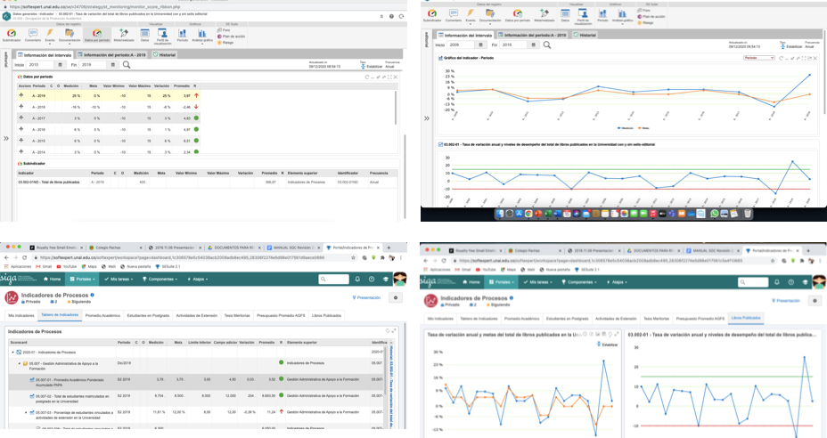
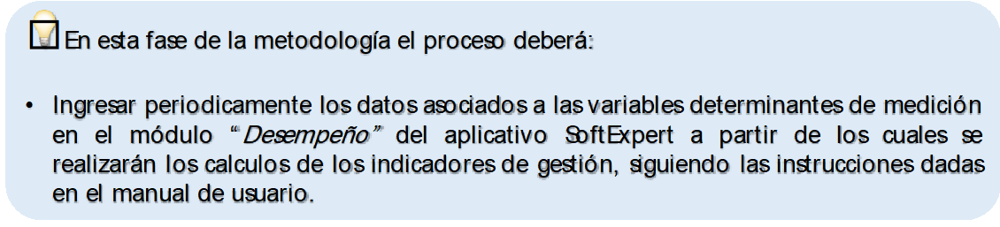

#	Medición de los indicadores de gestión de acuerdo con su periodicidad

Un indicador de gestión es útil una vez se ha medido, pues sólo hasta ese momento se puede establecer si la información resultante describe realmente la situación actual en que se encuentra un proceso a partir del comportamiento de sus variables determinantes.

Para realizar esta medición es necesario que el responsable asignado acuda a las fuentes de información y realice las consultas de los datos correspondientes de acuerdo con la periodicidad previamente definida, para su posterior registro en el módulo de “desempeño” del aplicativo SoftExpert con el usuario y clave asignado, de tal manera que se realicen los cálculos del valor final que tomará cada indicador de gestión en particular. El ingreso de la información deberá hacerse siguiendo las instrucciones dadas en el manual de usuario del mencionado módulo a través bien sea de las tareas pendientes asignadas o del menú *“General”* en el submenú *“Ejecución”*. (*Ver Figura \@ref(fig:figura19). Pantallazos medición de indicadores módulo “Desempeño” SoftExpert©*)

```{r figura19, echo=FALSE, out.width='80%', fig.align='center', fig.cap='Pantallazos medición de indicadores módulo de “Desempeño” SoftExpert©'}

```


```{r, echo=FALSE, out.width='80%', fig.align='center'}

```
