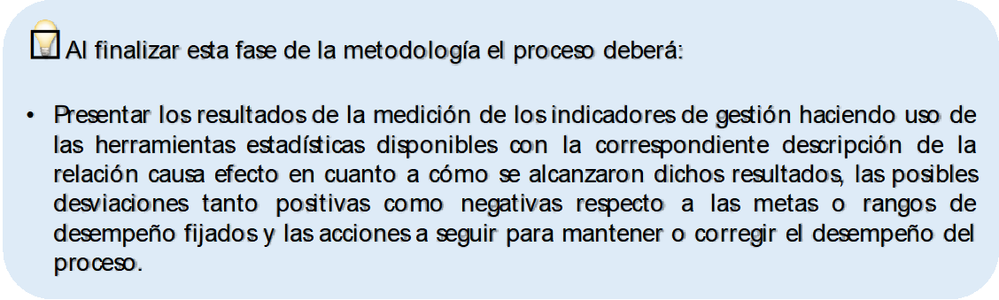

# Análisis de resultados de medición y toma de decisiones

Para la interpretación de los resultados obtenidos a partir de la recolección y el procesamiento de los datos asociados a los indicadores, estos deben ubicarse en el contexto del proceso al que pertenecen y de esta manera poder inferir específicamente sobre su comportamiento. Este tipo de análisis tiene que ver con la identificación de la relación causa efecto en cuanto a cómo se alcanzaron los resultados y establecer que tan lejos o cerca se está del logro de las metas o los rangos de desempeño propuestos. Por lo anterior es conveniente iniciar la argumentación respondiendo las siguientes preguntas:

*	¿El indicador cumplió/incumplió la meta o el rango de desempeño en el periodo de medición?
*	¿Cuáles fueron las causas del cumplimiento/incumplimiento de la meta o el rango de desempeño en el periodo de medición?
*	¿Qué acciones se deben tomar para mantener o alcanzar la meta o rango de desempeño propuesto?

De igual forma se recomienda presentar los resultados de medición de los indicadores haciendo uso de diferentes herramientas estadísticas, que permitan mostrar la distribución de los datos de acuerdo con características que sean de interés para los procesos. Como referente en este tema se tiene el informe técnico *ISO/TR 10017 Orientación sobre las técnicas estadísticas para la Norma ISO 9001:2000* y la *U.GU.SIGA.001 Guía Básica de Mejora V4* en el que se destacan herramientas de tipo descriptivo principalmente por su facilidad para el despliegue de los datos de manera simple a través de una variedad de métodos gráficos entre los que se encuentran:

*	El gráfico lineal (tendencia), compuesto por una serie de datos representados por puntos unidos por segmentos lineales, el cual se utiliza para ver el comportamiento de variables cuantitativas en el transcurso del tiempo.
•	El diagrama de dispersión, en el que se evalúa la relación entre dos variables a través de una representación gráfica de una de ellas en el eje X respecto a la otra en el eje Y.

*	El histograma, como una representación de variables cualitativas en forma de barras rectangulares cuya altura es proporcional a la frecuencia de los valores de la variable estudiada.

*	El diagrama circular (torta), que representa la proporción de elementos de cada uno de los valores de una variable. En donde cada porción representa cada valor que toma la variable.

*	El diagrama de Pareto, como representación de cada una de las categorías de las variables cuantitativas a través de un rectángulo que es proporcional a su frecuencia, de manera que se ordenan los datos por su frecuencia relativa o absoluta.

Por otra parte la U.GU.SIGA. 001 Guía Básica de Mejora V4 menciona las técnicas para la resolución de problemas que se enuncian a continuación, las cuales pueden ser de utilidad para enriquecer el análisis de resultados y la toma de decisiones:

*	Diagrama de causa – efecto (Espina de pescado), es una representación gráfica que permite identificar en este caso las causas de cumplimiento o incumplimiento de la meta de un indicador, clasificándolas en 5 categorías 5M (Método, Mano de obra, Maquinaria, Materiales y Medio ambiente). 

*	Cinco porque, se centra en el análisis de las causas del resultado de la medición del indicador a través de 5 preguntas sucesivas del por qué ocurre la situación concreta hasta llegar a la raíz que la origina.

Una vez se realice el análisis de resultados se tendrá acceso a información confiable y oportuna para hacer uso de ella en el proceso de toma de decisiones, es por esta razón que los indicadores de gestión pueden considerarse elementos que dan cuenta del comportamiento de las variables críticas de los procesos de tal manera que se pueda eliminar, incluir o ajustar aquello que sea más o menos útil para el logro de sus objetivos. Lo anterior parece simple, pero en la práctica para que exista un discernimiento organizacional efectivo es necesario tener en cuenta los siguientes aspectos:

*	Garantizar que los datos y la información de entrada para el cálculo de los indicadores de gestión son suficientemente precisos y fiables. Los datos se deben obtener de fuentes de información en lo posible oficiales o documentos y registros verificables.

*	Permitir el acceso a los datos a las partes interesadas del proceso. La Universidad debe establecer los medios adecuados para el almacenamiento y la consulta de la información a través de los canales institucionales oportunos (sistemas de información o informes de resultados).

*	Analizar los datos y la información con una metodología adecuada. Es necesario que se realice el seguimiento y análisis de los datos de una manera iterativa y con una frecuencia establecida de forma que se puedan separar aquellos que son relevantes de los que no lo son. También, se debe establecer rangos de desempeño para cada uno de los indicadores de gestión definidos en el sistema de medición y en el caso de superarlos o no alcanzarlos, formular acciones preventivas o correctivas según corresponda.

*	Implementar acciones basadas en el análisis objetivo de la información disponible, en equilibrio con la experiencia y conocimiento de los responsables de la toma de decisiones. En otras palabras, cualquier actividad planteada debe tener un análisis de causas asociado. 

*	El resultado de la ejecución de las acciones debe llevar a fortalecer la estrategia institucional, el logro de las metas propuestas, identificación y resolución de problemas y oportunidades, a un mayor entendimiento de los procesos y al igual que al mejoramiento de los controles institucionales.

```{r, echo=FALSE, out.width='80%', fig.align='center'}

```
