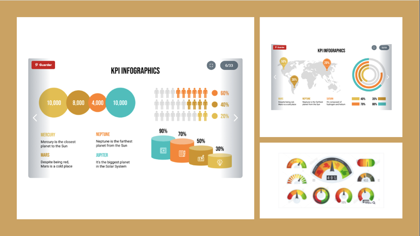
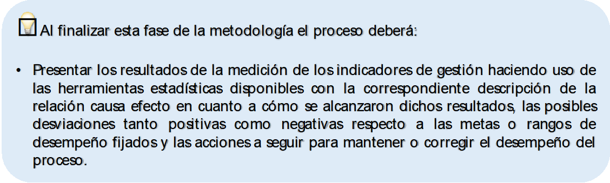

# Presentación de información a partes interesadas

Una parte fundamental de la cuantificación, medición y seguimiento a la gestión de los procesos consiste en la presentación de resultados a las partes interesadas de manera estructurada, bien sea para demostrar conformidad frente a los requisitos del sistema de gestión de calidad institucional y la normativa aplicable o como mecanismo de transparencia y rendición de cuentas puesto que se trata de una obligación y responsabilidad de cualquier entidad pública. En este sentido el informe de seguimiento a los indicadores de gestión debe cumplir con características como impacto visual de forma relacionando el orden cronológico y secuencial de la presentación de la información, así como en el uso de recursos gráficos, también debe tener profundidad en el contenido a través de una clara exposición de ideas, contemplando siempre el público al que va dirigido de tal manera que incentive su lectura en la medida que sea comprensible y consistente. Para la redacción del informe se puede emplear la estructura clásica que abarca una introducción, nudo y desenlace con los elementos que se muestran a continuación:

* En la **introducción** se presenta un texto breve en el que se aclara el objetivo del informe de tal manera que se pueda entender la totalidad del documento.

* En el **nudo** se detallan las realidades tanto positivas como negativas que han surgido como consecuencia de la medición de los indicadores de gestión. Esta parte del informe se compone de un texto explicativo alternado con gráficos como diagramas o infografías (Ver Figura \@ref(fig:figura20): Ejemplos infografías para la presentación de resultados) y tablas con datos fuente. Es importante tener presente que la extensión, profundidad y complejidad del análisis de resultados dependerá del tipo de redacción y la magnitud de la información base, sin embargo, es recomendable usar un lenguaje claro y sencillo y asegurar que se determinan las causas de dichos resultados y las repercusiones esperadas en los procesos.

* Y finalmente en el **desenlace** se formulan las reflexiones, conclusiones (juicios de valor) y acciones a tomar (mantener, prevenir o corregir) a partir de la información resultante.

Adicional a los elementos anteriores, el informe debe incluir la fecha y el responsable de su elaboración además de la imagen institucional de acuerdo con los formatos para la presentación de informes oficiales establecidos a nivel institucional.

```{r figura20, echo=FALSE, out.width='80%', fig.align='center', fig.cap='Ejemplos infografías para la presentación de resultados'}

```

Es importante mencionar que cada informe debe recoger, tanto los resultados obtenidos de las mediciones de los indicadores de desempeño, ordenados y estructurados utilizando el método que mejor se adapte a las necesidades de cada proceso (técnicas estadísticas), como la descripción cualitativa de las causas que originen bien sea el cumplimiento de las metas o rangos de desempeño o las desviaciones tanto positivas como negativas según el caso, así como las medidas tomadas para mantener o corregir estos resultados y regular la operación del proceso. De esta manera se podrá informar a las partes interesadas lo que sucede en la realidad del proceso y el por qué sucede esto.

Adicional a los informes, los procesos deben garantizar que los resultados de las mediciones de sus indicadores de gestión son accesibles para sus partes interesadas bien sea a través de la publicación de sus baterías en el enlace de *Transparencia y acceso a la información*, en las páginas web oficiales, o con la emisión de infografías vía postmaster y la promoción de su consulta en el módulo *“Desempeño”* del aplicativo SoftExpert, por mencionar algunos ejemplos.

## Monitoreo del sistema de indicadores de gestión de los procesos UNAL

El monitoreo del sistema de indicadores consiste en un método de autoevaluación en el que los procesos deberán realizar una revisión periódica, al menos dos veces al año (puede ser semestral), de cada indicador de desempeño, así como de las mediciones, del análisis de resultados y las acciones derivadas de este, asegurando su validez y calidad y consignando sus apreciaciones en las plantillas que establezca el SIGA. Se debe tener en cuenta que uno de estos monitoreos podrá corresponder con el reporte que se presenta en la revisión por la dirección del SGC.

```{r, echo=FALSE, out.width='100%', fig.align='center'}

```
