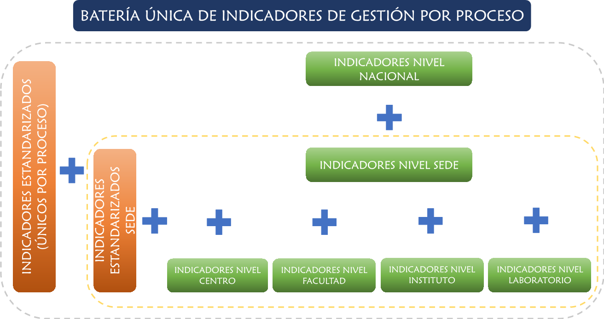

# Diseño de la batería (Tablero de control) de indicadores de gestión por proceso

Para garantizar que la medición de los indicadores refleje la gestión de la totalidad de los procesos aplicables en la UNAL es necesario establecer sus diferentes niveles de aplicación teniendo en cuenta los contextos particulares (nivel nacional, sedes andinas y de presencia nacional, centros, facultades, institutos y laboratorios) en los que se despliegan sus objetivos. En efecto, el hecho de contar con múltiples indicadores asociados a un mismo proceso requiere de una estructura y forma de presentación que facilite su análisis sin que pierdan relevancia o muestren comportamientos disfuncionales asociados a un exceso de información. Por lo que, en la figura \@ref(fig:figura21) se propone el modelo institucional para la adopción de una batería de indicadores por proceso concebida como una herramienta que permite su gestión de acuerdo con los roles y responsabilidades definidos y su consolidación a nivel institucional, buscando que los indicadores que la conforman se complementen entre si y puedan ofrecer una visión completa respecto al cumplimiento de sus objetivos y metas.

```{r figura21, echo=FALSE, out.width='80%', fig.align='center', fig.cap='Estructura baterías de indicadores de gestión por proceso UNAL'}

```

Con base en lo anterior, se tiene los siguientes tipos de indicadores de gestión aplicables en los procesos de la UNAL:

* **Indicadores estandarizados (únicos):** Esta categoría agrupa indicadores cuyos atributos (nombre, descripción, fórmula, periodicidad, meta, línea base, etc…) son idénticos en todos los niveles de aplicación (nacional, sedes andinas y de presencia, facultades, centros, institutos y laboratorios) y solo varían las mediciones puntuales que se ejecuten en cada uno de ellos. También se pueden enmarcar en esta categoría los indicadores que se calculan de manera consolidada a nivel institucional y entregan un solo dato para toda la universidad.

* **Indicadores nivel nacional:**Consisten en indicadores que son formulados y medidos exclusivamente en los procesos en el nivel nacional y no tienen cobertura en los niveles inferiores.

* **Indicadores estandarizados sede:** Contemplan formulaciones y mediciones que abarcan los procesos en los niveles central, facultades, centros, institutos y laboratorios para una o varias sedes. 

* **Indicadores nivel sede:** Abarcan formulación y mediciones en los procesos de una o varias sedes a nivel central sin llegar a las facultades, centros, institutos y laboratorios.

* **Indicadores nivel centro / facultad / instituto / laboratorio:** Son medidas que determinan la gestión de los procesos puntualmente en facultades, centros, institutos y laboratorios sin llegar a aplicarse en los niveles superiores. Cuentan con variables determinantes de medición, fórmulas y metas propias.

