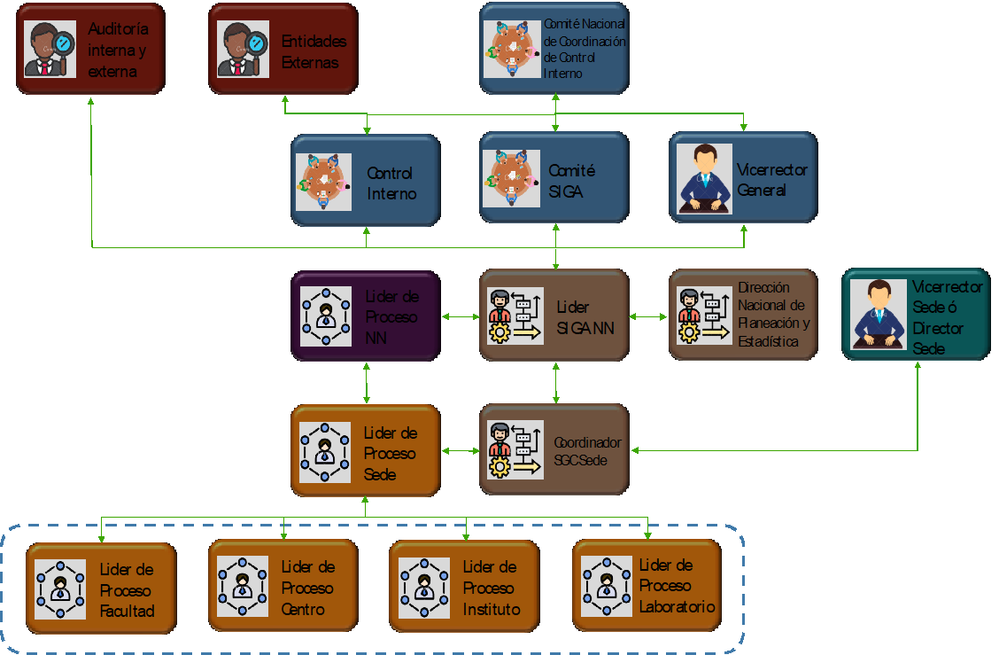

# Esquema de comunicación frente a la definición de indicadores de gestión

De acuerdo con la definición de los roles y responsabilidades (*Ver Tabla \@ref(tab:tabla2): Roles en la cuantificación, medición y seguimiento a la gestión de los procesos en la UNAL*) para el desarrollo de las diferentes actividades asociadas al componente de cuantificación, medición y seguimiento a la gestión de los procesos se determinó una estructura de flujo de comunicación (*Ver Figura \@ref(fig:figura22): Estructura flujo de comunicación componente medición, cuantificación y seguimiento UNAL*), la cual permite visualizar el grado de participación de los diferentes actores y enmarcar acuerdos y compromisos que puedan dar claridad sobre los grados de responsabilidad de cada uno de ellos frente a la información desde su recolección, pasando por su producción y análisis hasta su difusión. Esto contribuirá significativamente en la calidad y oportunidad de la toma de decisiones y el mejoramiento de los procesos.

```{r figura22, echo=FALSE, out.width='80%', fig.align='center', fig.cap='Estructura flujo de comunicación componente medición, cuantificación y seguimiento UNAL'}

```

Esta estructura debe aplicarse en las diferentes etapas en las que se desarrolla la metodología para la definición de los indicadores de gestión garantizando tanto su apropiación como su correcta puesta en marcha en todos los niveles en los que se despliegan los procesos de la UNAL. El flujo de comunicación se da en sentido descendente desde el líder de los procesos en el nivel nacional hacia los líderes en niveles más bajos (Sede – Facultad, Centro, Instituto, Laboratorio), en concordancia con el nivel de aplicación definido en su correspondiente caracterización, esto quiere decir que si un proceso no tiene aplicación en el nivel nacional este se obviará en la batería de indicadores, por ejemplo. De igual forma se debe tener en cuenta el uso, en lo posible, de redes formales de comunicación para coordinar las tareas derivadas del despliegue del componente de cuantificación, medición y seguimiento a la gestión, de tal manera que se garantice la calidad y oportunidad en la entrega de la información de todos los niveles para su recopilación institucional. 