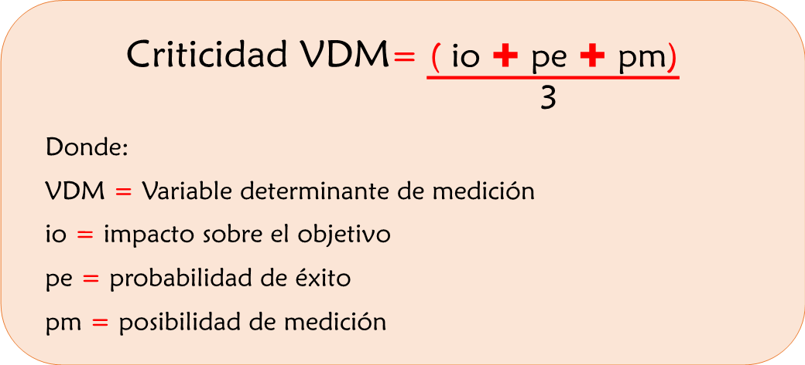

# Anexos {#anexos}

### Anexo 1: Lineamientos para la priorización de variables determinantes de medición

Para la priorización de las variables determinantes de medición, se adaptó el procedimiento propuesto por @plasencia2017procedimiento en cuanto a la evaluación de su criticidad en función de tres criterios. Uno es el impacto sobre los objetivos, el otro es la objetividad de los datos para la medición (confiabilidad) y por último la capacidad de gestión. El primer criterio se relaciona con las consecuencias positivas que tiene la variable evaluada para el cumplimiento del objetivo del proceso, el segundo criterio busca establecer el nivel de independencia en la medición, es decir que los resultados guarden consistencia y estabilidad y el tercer criterio tiene que ver con la posibilidad de actuar sobre las variables para obtener mejores efectos. Estos criterios se estiman en escalas similares a las que se usan para la evaluación de la gestión del riesgo, asignando etiquetas y valores ordinales en escala tipo Likert para matizar la opinión de los responsables de la evaluación, tal como se muestra a continuación:

```{r tablaA, echo=FALSE}
valor1 <- c("1","2","3","4","5")
nivel1 <- c("Insignicante", "Menor", "Moderado", "Alto", "Muy alto")
descripcion1 <- c("La variable no tiene incidencia en el cumplimiento del objetivo del proceso o en el logro de metas asociadas.", "La variable tiene baja incidencia en el cumplimiento del objetivo del proceso o en el logro de metas asociadas.", "La variable tiene alguna incidencia en el cumplimiento del objetivo del proceso o en el logro de metas asociadas.", "La variable tiene incidencia en el cumplimiento del objetivo del proceso o en el logro de metas asociadas.", "La variable tiene incidencia determinante en el cumplimiento del objetivo del proceso o en el logro de metas asociadas.")
tablaA <- data.frame(`Valor` = valor1, `Nivel`= nivel1, `Descripción`= descripcion1)
knitr::kable(tablaA, caption = '*Parámetros de impacto sobre el objetivo*' )
```

```{r tablaB, echo=FALSE}
valor2 <- c("1","2","3","4","5")
nivel2 <- c("Insignicante", "Menor", "Moderado", "Alto", "Muy alto")
descripcion2 <- c("La variable no tiene mediciones consistentes durante la ejecución del proceso.", "Las mediciones de la variable son imprecisas a lo largo de la ejecución del proceso.", "Algunas mediciones de la variable son inconsistentes a lo largo de la ejecución del proceso.", "La variable presenta pocos errores de medida durante la ejecución del proceso.", "Las mediciones de la variable son precisas en todo momento durante la ejecución del proceso.")
tablaB <- data.frame(`Valor` = valor2, `Nivel`= nivel2, `Descripción`= descripcion2)
knitr::kable(tablaB, caption = '*Parámetros de confiabilidad de los datos*' )
```

```{r tablaC, echo=FALSE}
valor3 <- c("1","2","3","4","5")
nivel3 <- c("Insignicante", "Menor", "Moderado", "Alto", "Muy alto")
descripcion3 <- c("No es posible ejercer influencia sobre los resultados de la medición de la variable con la capacidad disponible.", "Se requiere un esfuerzo adicional para incidir en las mediciones de la variable en las condiciones actuales.", "Se cuenta con un nivel intermedio de control sobre la variable.", "Es posible influir en los resultados de la medición de la variable.", "Se tiene total capacidad de gestión sobre la variable.")
tablaC <- data.frame(`Valor` = valor3, `Nivel`= nivel3, `Descripción`= descripcion3)
knitr::kable(tablaC, caption = '*Parámetros de gestión sobre la variable*' )
```

Para establecer la criticidad de cada variable determinante de medición se calcula el promedio de los valores asignados a los tres criterios mencionados (\@ref(tab:tablaA), \@ref(tab:tablaB), \@ref(tab:tablaC)) aplicando la fórmula que se muestra en la siguiente figura:

```{r texto10, echo=FALSE, out.width='60%', fig.align='center', fig.cap='Ecuación para la evaluación de la criticidad de las variables determinantes de medición'}

```

El resultado que se obtiene de la operación anterior se ubica en una escala ordinal que va de 1 a 5, con tres rangos:   *“bajo”*, *“medio”* y  *“alto”* que se describen en la \@ref(tab:tablaD). De esta manera se logra establecer el nivel de criticidad de cada variable determinante de medición.

```{r tablaD, echo=FALSE}
valor4 <- c("Entre 1 y 2,5 inclusive", "Entre 2,5 y 3,5 inclusive", "Entre 3,5 y 5 inclusive")
nivel4 <- c("Bajo", "Medio", "Alto")
descripcion4 <- c("Variables que tienen menor incidencia en el cumplimiento del objetivo del proceso ", "Las variables tienen una afectación intermedia en el cumplimiento del objetivo del proceso.", "En este rango se ubican las variables que afectan significativamente el cumplimiento del objetivo del proceso.")
tablaD <- data.frame(`Valor` = valor4, `Nivel`= nivel4, `Descripción`= descripcion4)
knitr::kable(tablaD, caption = '*Niveles de criticidad de las variables de medición*' )
```

Una vez se tiene la evaluación de la totalidad de las variables determinantes de medición se seleccionan aquellas que obtuvieron las mayores calificaciones, en lo posible las que se encuentren en un nivel de criticidad *“Alto”* para iniciar la construcción de los correspondientes indicadores de gestión.

### Anexo 2: Aplicación del modelo de cuantificación, medición y seguimiento a la gestión de los procesos a otros sistemas del siga

La metodología para la cuantificación, medición y seguimiento al desempeño de los procesos que hace parte del SGC de la UNAL y que se expone en la presente guía, es replicable a los demás sistemas de gestión conforman el modelo SIGA, de igual forma el aplicativo SoftExpert permite la parametrización las particularidades de los tableros de control requeridos con el fin de sistematizar la totalidad de la información institucional en el módulo de *“desempeño”*.

Para su adaptación se deberán tomar en cuenta las particularidades de cada sistema de gestión (Ambiental, Seguridad de la Información, Seguridad y Salud en el Trabajo, Gestión Documental, Laboratorios, etc.) derivadas principalmente de la normativa aplicable. A manera de ejemplo a continuación, se enuncian aspectos particulares para tener en cuenta en la medición del desempeño de algunos de los sistemas que hacen parte del modelo SIGA:

* En el caso del Sistema de Seguridad de la Información, la NTC ISO 27001:2013  @ri2014tecnologia describe en el numeral 9.1 Seguimiento, medición, análisis y evaluación, la necesidad de determinar qué se debe medir tomando en cuenta los procesos y los controles de seguridad de la información, así mismo cuáles son los métodos por usar garantizando la validez de los resultados de las mediciones del desempeño, la periodicidad y el análisis de los datos obtenidos.

* Por otra parte, el Decreto 1072 de 2015 @de2015decreto  señala en su Capítulo 6, Artículos 2.2.4.6.16, 2.2.4.6.17, 2.2.4.6.19, 2.2.4.6.20, 2.2.4.6.21 y 2.2.4.6.22 que se deben definir indicadores que evalúen la estructura, el proceso y los resultados del Sistema de Seguridad y Salud en el Trabajo. Así mismo establece que para la construcción de estos indicadores la entidad debe considerar aspectos como la Política de Seguridad y Salud en el Trabajo, los objetivos y metas propuestos, los planes de trabajo anuales, el plan de capacitación, el plan de atención y prevención de emergencias, el método para la identificación de peligros y evaluación y calificación de riesgos, la evaluación de las condiciones de salud de los trabajadores, el cumplimiento de normativa aplicable, entre otros.

* En lo que corresponde al Sistema de Gestión Ambiental, la NTC ISO 14001:2015 @cubana2004sistemas precisa que las organizaciones deben evaluar el cumplimiento de sus requisitos legales entre otros con una frecuencia determinada e implementar acciones a partir de los resultados obtenidos.

* El Modelo de Acreditación en Alta Calidad actualizado mediante el Acuerdo 02 de 2020 , establece en su artículo 20 “” Factor 4 *“Mejoramiento continuo y autorregulación”* Característica 15 *“Sistema interno de aseguramiento de la calidad”*, que las instituciones deben contar con indicadores de diversos tipos para hacer seguimiento a su gestión y lograr un mejoramiento continuo.

Si bien cada sistema en particular debe cumplir con ciertos requisitos para la medición de su desempeño, con el modelo de cuantificación, medición y seguimiento a la gestión desarrollado en esta guía, es posible armonizar los elementos convergentes que se mencionan en las diferentes normas, para fortalecer un sistema de indicadores institucional integrado y estructurado que se despliegue en diferentes niveles (a nivel de sistemas de gestión o a nivel de procesos).

```{r tablaE, echo=FALSE}
valor4 <- c("Entre 1 y 2,5 inclusive", "Entre 2,5 y 3,5 inclusive", "Entre 3,5 y 5 inclusive")
nivel4 <- c("Bajo", "Medio", "Alto")
descripcion4 <- c("Variables que tienen menor incidencia en el cumplimiento del objetivo del proceso ", "Las variables tienen una afectación intermedia en el cumplimiento del objetivo del proceso.", "En este rango se ubican las variables que afectan significativamente el cumplimiento del objetivo del proceso.")
tablaD <- data.frame(`Valor` = valor4, `Nivel`= nivel4, `Descripción`= descripcion4)
knitr::kable(tablaD, caption = '*Niveles de criticidad de las variables de medición*' )

```

> Elaboró: Equipo SIGA Nivel Nacional
>
>> Cargo: Analista
>
>>> Fecha: 28/12/2020
>
> Revisó: Alberto Rodríguez Rodríguez
>
>> Cargo: Asesor DNPE
>
> Aprobó: Gloria Inés Cardona Giraldo
>
>> Cargo: Asesora VRG y Líder SIGA NN8


